  

  

  
  
  

  

# Arman Nouromid · Data, BI & AI automation

Data & BI engineer by trade: Data Vault 2.0, SQL Server, SSIS/BIML, Power BI, Azure Fabric & Synapse. Outside that, I build AI automation end to end: multi-agent Claude Code systems, a self-maintaining Obsidian "second brain" that several of my own agents read and write to, and finance/trading and content-automation agents with real safety layers (kill switches, position/risk caps) rather than letting a model act unchecked. Case studies are on the [portfolio site](https://armannouromid.com), evidence-linked to real projects rather than just a skills list.

<strong>Start here</strong>

> [!TIP]
> **Hiring for data warehousing or BI?** The [portfolio](https://armannouromid.com) has the case studies, each linked to its evidence.

> [!TIP]
> **Lost a Claude Code session?** [ResumerAgent](https://github.com/Arman-no/ResumerAgent) lists every session on your machine, including the dead ones, and resumes any of them in one click.

> [!TIP]
> **Page blocked by a bot wall?** [web-scraping-toolkit](https://github.com/Arman-no/web-scraping-toolkit) fetches it as markdown through a stealth browser, and doubles as a Claude Code skill.

> **October 2026:** ResumerAgent gained a cost / context / limit table, a portable statusline sidecar (`npm run setup-statusline`) and safety hardening. Upstream, I root-caused and fixed a bug in [obsidian-second-brain](https://github.com/eugeniughelbur/obsidian-second-brain): its SessionStart hook never loaded the vault's operating rules ([PR #288](https://github.com/eugeniughelbur/obsidian-second-brain/pull/288)).

  <a href="#what-i-do">What I do</a> ·
  <a href="#recent-contribution">Recent contribution</a> ·
  <a href="#projects">Projects</a> ·
  <a href="#stack">Stack</a>

## What I do

| Layer | In practice |
| :--- | :--- |
| **Store** | Data Vault 2.0, SQL Server, SSIS/BIML, T-SQL |
| **See** | Power BI, DAX, Azure Fabric & Synapse |
| **Act** | Multi-agent Claude Code systems, an Obsidian vault as shared memory, agents with kill switches and position/risk caps |

## Recent contribution

Filed and fixed a real bug in [obsidian-second-brain](https://github.com/eugeniughelbur/obsidian-second-brain) (a Claude Code skill with 1,000+ stars for giving agents persistent memory via an Obsidian vault): its SessionStart hook silently never loaded the vault's own operating rules, because it only checked an environment variable that a standard install never actually sets. Root-caused, fixed, and opened as [PR #288](https://github.com/eugeniughelbur/obsidian-second-brain/pull/288).

## Projects

<table>
<tr>
<td width="50%" valign="top">
 

<a href="https://resumeragent.armannouromid.com">site</a>
</td>
<td width="50%" valign="top">
 

</td>
</tr>
<tr>
<td width="50%" valign="top">
 

</td>
<td width="50%" valign="top">
 

</td>
</tr>
</table>

## Stack

  
  
  
  
  

`SQL Server` `T-SQL` `SSIS` `BIML` `Power BI` `DAX` `Azure Fabric & Synapse` — `Python` `TypeScript` `Claude Code` `Obsidian` `MCP`

<strong>Projects in plain text</strong>

| | |
|---|---|
| [**ResumerAgent**](https://github.com/Arman-no/ResumerAgent) · [site](https://resumeragent.armannouromid.com) | Local dashboard that finds every Claude Code session, including the dead ones `claude agents` can't list, and resumes any of them in one click. Node.js, zero runtime dependencies, CI on Windows/macOS/Linux, MIT. |
| [**web-scraping-toolkit**](https://github.com/Arman-no/web-scraping-toolkit) | Two self-contained Python CLIs for pages a plain request can't read: a stealth-browser fetcher (Scrapling) returning markdown from bot-walled and JS-rendered pages, and a local Instagram-reel transcriber (faster-whisper, CPU only). Registered as a Claude Code skill. |
| [**Moonshine Jewellery**](https://moonshinejewellery.de) | E-commerce platform moving a handmade jewellery business off a marketplace onto its own checkout: Medusa v2 backend, Next.js storefront, Postgres, Redis, Stripe, Etsy sync. Live. |
| [**armannouromid.com**](https://armannouromid.com) | Portfolio with evidence-linked case studies from the data-warehouse work and the side projects above. |

